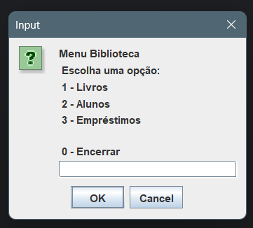

# ABBA: Aplicação Brasileira para Bibliotecas Acadêmicas

**ABBA é um projeto fictício 
que visa gerenciar as transações básicas de uma biblioteca.**

## Como ABBA pode ser útil
Este software pode ser extremamente útil para instituições de ensino, especialmente faculdades e universidades. 
ABBA  permite o gerenciamento eficiente e organizado das operações básicas da biblioteca. 
Com este software, bibliotecas podem registrar leitores e funcionários, gerenciar empréstimos e devoluções de livros, manter um controle preciso dos livros que estão emprestados e quais usuários os pegaram emprestados, além de permitir o cadastro de novos livros.

Ao permitir que as bibliotecas gerenciem essas operações de forma eletrônica e eficiente, o software pode ajudar a economizar tempo e recursos, além de permitir que as bibliotecas forneçam um serviço melhor e mais ágil aos seus usuários. 

## Principais Recursos
- Cadastrar novos Usuários, Livros e Empréstimos
- Editar e Excluir cadastros realizados de Alunos e Livros
- Visualizar transações e registros
- Reinicializar registros de Usuários, do Acervo e de Transações
- Acessar os registros em diferentes dispositivos

## Screenshots

## Linguagens e Tecnologias
<table>
  <thead>
    <tr style="border: none;">
      <th style="border: none;">Java</th>
      <th style="border: none;">JComponent</th>
      <th style="border: none;">Git</th>
      <th style="border: none;">GitHub</th>
    </tr>
  </thead>
  <tbody >
    <tr style="border: none;">
      <td style="border: none;"></td>
      <td style="border: none;"></td>
      <td style="border: none;"></td>
      <td style="border: none;"></td>
    </tr>
  </tbody>
</table>

## Técnicas Praticadas
- Herança e Encapsulamento
- Polimorfismo com Override
- Persistência de dados em arquivos .dat
- Tratamento de Erros e Exceções
- Desenvolvimento em grupo

## Disponibilidade
Este projeto não tem uma versão executável. Mas você pode fazer um fork deste repositório ou baixá-lo para dar continuidade no teu dispositivo.

Para baixar, clique aqui.

## Autoria
_Em ordem alfabética:_
- Abner Andrade
- Joyce Lemos
- Vinícius Reis